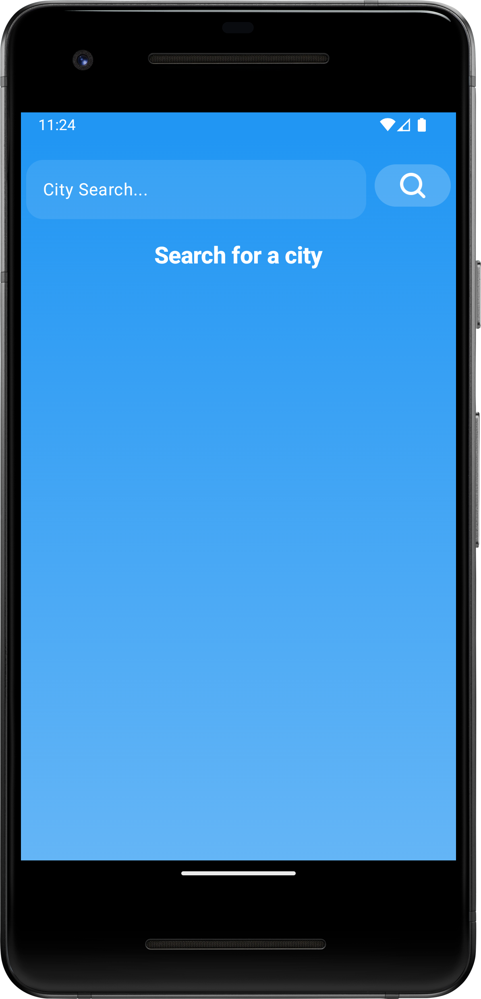
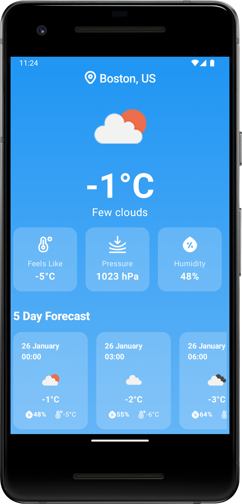

# 
WeatherWise - Basic Weather App With Jetpack Compose

## 📌 Overview
**WeatherWise is a modern mobile application that provides real-time weather updates through a minimalist interface. Users can easily view current weather conditions and detailed 5-day forecasts.**

---

## 📸 Screenshots
<table>
    <tr>
        <td align="center">
            <strong><h2>Main Screen</h2></strong>
            
        </td>
        <td align="center">
            <strong><h2>5-Day Forecast</h2></strong>
            
        </td>
        <td align="center">
            <strong><h2>Details</h2></strong>
            
        </td>
    </tr>
</table>

---

## 🛠️ Technologies Used

### Architecture & Core
- **Android Gradle Plugin (AGP): 8.8.0**
- **Kotlin: 2.1.0**
- **MVVM + Clean Architecture**
- **Jetpack Compose (BOM: 2024.04.01)**
- **Material Design 3**
- **Hilt (DI): 2.51.1**
- **KSP: 2.1.0-1.0.29**

### Networking
- **Retrofit: 2.11.0**
- **Gson Converter: 2.11.0**
- **Coil (Image Loading): 3.0.4**

### Data Management
- **Room: 2.6.1**
- **Flow**
- **Coroutines: 1.9.0**

### Jetpack Components
- **Navigation Compose**
- **Lifecycle (Runtime: 2.8.7, ViewModel: 2.8.7)**
- **Activity Compose: 1.9.3**
- **Hilt Navigation Compose: 1.2.0**

---

## ✨ Key Features

- 🌦️ Real-time weather updates
- 📅 Detailed 5-day weather forecast
- 🎨 Clean and user-friendly interface
- 📍 Location-based data retrieval
- 🗂️ Local caching (Room)
